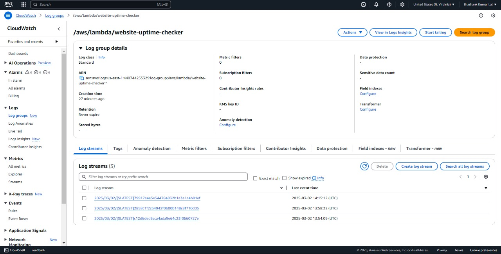

# Cloud-Mark-2

## Website Uptime Monitoring with AWS Lambda and S3

Overview

This project automates website uptime monitoring using AWS Lambda, S3, and CloudWatch. It checks the website status every 5 minutes and logs the results in an S3 bucket. CloudWatch alarms can notify you via email when the website is down.

Features

Automated uptime checks every 5 minutes

Logs website status in an S3 bucket

Sends alerts via AWS CloudWatch and SNS when the website is down

Uses AWS Lambda for serverless execution

Architecture

Lambda Function - Periodically checks the website status.

S3 Bucket - Stores the logs of website uptime.

CloudWatch - Triggers the Lambda function and monitors logs.

SNS Notification - Sends alerts when the website is down.

Project Setup

1. Create an S3 Bucket

Go to AWS S3 Console.

Click Create bucket.

Name the bucket (e.g., website-uptime-logs-04112004).

Enable public access blocking (recommended).

Click Create bucket.

OBJECTS IN S3 BUCKET:

2. Create a Lambda Function

Open AWS Lambda Console.

Click Create function.

Choose Author from scratch.

Enter function name (e.g., website-uptime-checker).

Choose Python 3.9 as runtime.

Click Create function.

DEPLOY THE PYTHON CODE ------------

4. Set IAM Permissions

Go to IAM Console.

Click Roles > Find LambdaRole-website-uptime-checker.

Click Add Permissions > Attach policies.

Search for AmazonS3FullAccess and attach it.

5. Test Lambda Function

Open Lambda.

Click Test.

Create a test event (default settings).

Click Test to check logs in S3.

Automate Execution with CloudWatch

1. Open CloudWatch Console

Search for CloudWatch in AWS Console.

Go to Rules > Create Rule.

2. Configure Rule

Set Event Source to Schedule.

Choose Fixed rate: 5 minutes.

Under Target, select AWS Lambda.

Choose the function website-uptime-checker.

Click Enable Schedule and create the rule.

3. Verify Logs

Go to CloudWatch > Logs.

Find /aws/lambda/website-uptime-checker.

Open latest logs to confirm execution.

Set Up CloudWatch Alarms

MONITOR A PARTICULAR LOG EVENT ON CLOUDWATCH

1. Create an SNS Topic

Go to Amazon SNS > Topics.

Click Create Topic.

Name it WebsiteUptimeAlerts.

Click Create Topic.

2. Subscribe to SNS

Go to Subscriptions > Create Subscription.

Choose Email.

Enter your email.

Click Create Subscription.

Confirm the subscription via email.

3. Create CloudWatch Alarm

Go to CloudWatch > Alarms > Create Alarm.

Choose Lambda > By Function Name > Errors.

Select website-uptime-checker.

Set Threshold: >= 1 error in 5 minutes.

Attach SNS topic WebsiteUptimeAlerts.

Click Create Alarm.

CloudWatch logs and alarms will show website uptime and downtime. Here’s what that means:

✅ Uptime (Website is Up)
When your website is working fine, CloudWatch will record successful HTTP requests (status 200 OK).
The alarm will stay in the OK state.
No action needed—you won’t get any alerts.
🚨 Downtime (Website is Down)
If your website stops responding or returns an error (e.g., 500, 503, timeout), CloudWatch detects it.
The alarm will switch to ALARM state.
You’ll get an email notification via SNS saying your website is down.
The logs will show failed requests and errors.
🔄 Every 5 Minutes…
Your Lambda function runs and checks the website’s status.
CloudWatch logs each result (success or failure).
If the site is down, CloudWatch triggers the alarm, and you’ll get notified.
You can watch these logs in CloudWatch Logs → Log Groups and see your alarm state under CloudWatch Alarms

FOLLOWING IS THE RESULT OF WEBSITE CONDITION  OF REVA UNIVERSITY 

